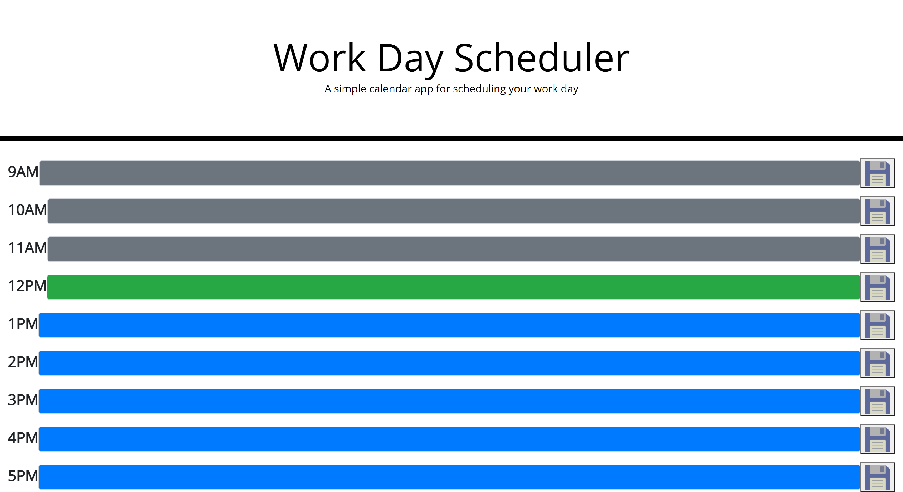

# Schedule-Maker

## Table of Contents
1. [Desciption](#description)
2. [Visuals](#visuals)

## Description
This website is a work day schedule, it has blocks to add information from 9am - 5pm, the blocks are forms that can be use to save information and when refreshed will still be there. The background colors are based on what the local time is on your device, grey being past, green being present, and blue being future. The website works for handheld devices as well

[Link to Live Site](https://revilite.github.io/Schedule-Maker/)

## Visuals

